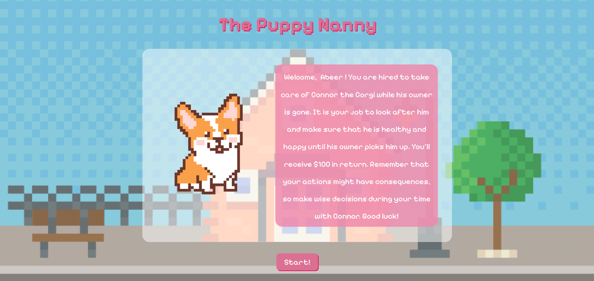
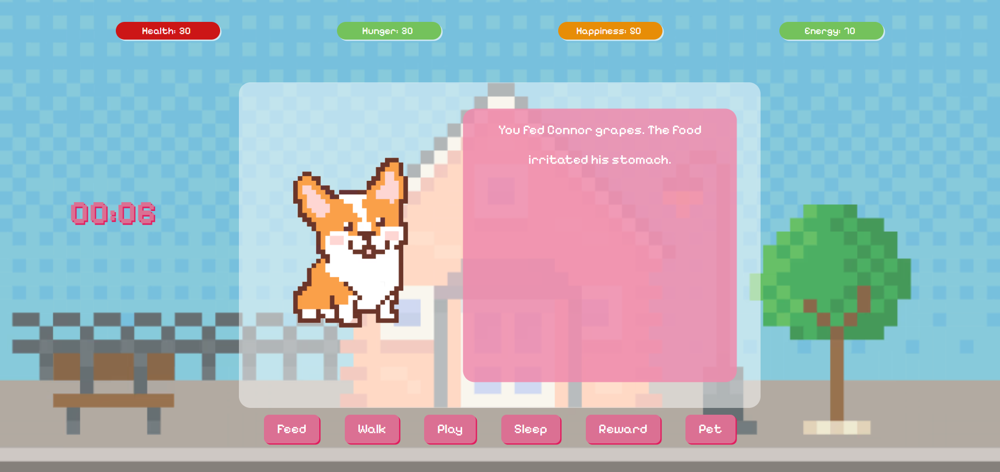

# The Puppy Nanny - A Mini Dog Sitting Game
### By Abeer Rozba - 12th February 2026
[Linkedin](www.linkedin/in/abeerrozba) | [Github](https://github.com/abeer-rozba)
***
### Description
#### This is a JavaScript web-based game where you play as a dog sitter. You have to take care of a puppy until his owner returns. You must keep the puppy happy, healthy, energized, and well-fed. Every action you take will affect the dog's status differently. Make sure that the dog is healthy overall when the owner picks him up. Random events will occur, and depending on your reaction, the situations might resolve or have lasting consequences.

### Technologies Used:
- HTML
- CSS
- JavaScript

### Screenshots

### Getting Started
1. Fork and clone this repository to your machine.
2. Open the index.html in a live server.
3. Alternatively, you can navigate to this [live website](http://thepuppynanny.surge.sh/) to play the game.
4. Now you can start the game.
5. Take care of the dog and keep him healthy at all times!
6. If any of the dog's status go under 20, you might get in trouble.
7. Make wise decisions, your choices will affect the story.

### Future Updates
- [] Eliminating occasional bugs
- [] Adding sound effects to enhance user experience
- [] Adding a variety of dog breeds and personalities
- [] Adding more random events and reactions
- [] Allow users more control (ex. choose what to feed the dog, what games to play, how long to walk him...)
- [] Adding the option to choose between cat and dog, each having a different story
- [] More animations and visuals

### Credits
- [Using local storage 1](https://stackoverflow.com/questions/32931196/how-to-pass-user-input-from-one-html-page-to-another-using-local-storage)
- [Using local storage 2](https://coreui.io/answers/how-to-get-an-item-from-localstorage-in-javascript/)
- [Navigating pages using JavaScript](https://stackoverflow.com/questions/4744751/how-do-i-redirect-with-javascript)
- [Div centering settings](https://www.reddit.com/r/webdev/comments/1diix0e/centering_a_div_nowadays_what_are_the_best/)
- [Vertical div alignment](https://stackoverflow.com/questions/9629312/align-text-to-left-and-vertically-center-in-div)
- [Mouse pointer effect](https://stackoverflow.com/questions/4564251/change-the-mouse-pointer-using-javascript)
- [Storing functions in arrays: JavaScript 1](https://stackoverflow.com/questions/3592468/can-i-store-javascript-functions-in-arrays)
- [Storing functions in arrays: JavaScript 2](https://www.geeksforgeeks.org/javascript/array-of-functions-in-javascript/)
-[Creating a timer in JavaScript](https://community.testmuai.com/t/how-can-i-create-a-simple-javascript-countdown-timer/31822/2)
